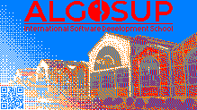
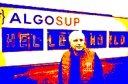
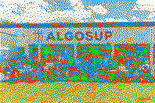
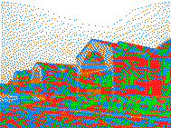
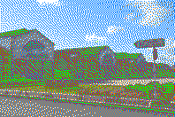

# Rubik's art

Table of Contents

- [Overview](#overview)
- [Stakeholders](#stakeholders)
- [Scope](#scope)
- [Personas and use cases](#personas-and-use-cases)
- [Evaluation criteria](#evaluation-criteria)
- [Proposed designs](#proposed-designs)
  - [Selected solution](#selected-solution)
  - [Disregarded solutions](#disregarded-solutions)
- [Risks and assumptions](#risks-and-assumptions)
- [Non-functional specifications](#non-functional-specifications)
- [Maintaining](#maintaining)
- [Glossary](#glossary)

---

## Overview

ALGOSUP is looking for someone to produce a 60-100 square feet (5.57-9.29 square meter) fresco entirely made of Rubik’s cubes.  
The fresco will be a permanent feature of the school, displayed in what is currently the library and visible from the outside.

Each cube is to be treated as a 3x3 pixel matrix with each panel being a pixel of either green, yellow, red, orange, blue or white color.  
The library may have to be rearranged or moved in order to make the fresco more visible.

## Stakeholders 

|                                                   Profile                                                    | Name & link                                                | Description    |
| :----------------------------------------------------------------------------------------------------------: | ---------------------------------------------------------- | -------------- |
|                         | [ALGOSUP](https://www.algosup.com/)                        | Client company |
|        | [Lucas AUBARD](https://github.com/LucasAub)                | Team member    |
|                 | [Vivien BISTREL](https://github.com/Bistrel2002)           | Team member    |
|        | [Léo CHARTIER](https://github.com/leo-chartier)            | Team member    |
|     | [Quentin CLÉMENT](https://github.com/Quentin-Clement)      | Team member    |
|  | [Aurélien Fernandez](https://github.com/aurelienfernandez) | Team member    |
|    | [Thomas Planchard](https://github.com/thomas-planchard)    | Team member    |
|                                       | Students and other building employees                      | End user       |
|                                     | Passer-by                                                  | End user       |
<!-- Note to team members: add remainings (Communauté de Communes, Franck Jeanning, ...) -->

## Scope

The main objective is to create a fresco that is both accepted by ALGOSUP and eye-pleasing.

## Personas and use cases

Yves: Citizen of Vierzon who often passes by the "rue de la société française". He is 56 years old and has 2 children (a 17 years old daughter and a 15 years old son). He doesn't know any school in the city.  
<!-- TODO: Reformulate
If he sees the fresco everyday, he will see ALGOSUP's name and one day he will be curious and search for informations about it. He will talk about the school to his sons and maybe one of them will either talk to their friends about the school or even join ALGOSUP.
-->

## Evaluation criteria 

The fresco will be evaluated based on some criteria:
- The overall fresco should not contain more than 3000 cubes and no less than 2000 cubes.
- The Fresco must be of rectangular form.
- The B3 (school's building) must be evoqued on the fresco.
- The fresco must include ALGOSUP’s logo
- If text is used, it must be in English
- The cubes must not be disassembled and must be rotated into position

Additionally, recording of the construction must be provided in the form of a video or timelapse for the school's social media. 

## Proposed designs

1.  Some point on the evaluation criteria above will be taken into account when designing the fresco, all proposal on the designing face shall be done by the team members, and the final design have to be approve by all the members. 
2.  An image software will be used to design fresco so that it matches with the desire number of rubiks cube.
### Selected solution
 

This image is the fresco selected by the entierety of our team. We choose this solution for it's simplicity, this view of the building show how important are ALGOSUP's roots within the city of Vierzon. Moreover, on the bottom left, you can see a QR code, this code redirect directly to ALGOSUP's official website.

### Disregarded solutions
 
 
 
 
 

During the research process we experimented a few design. As you can see they weren't very eye-pleasing. The first image shows how colors could be saturated by using strong colors without balancing the image's colors properly. The following images are showing how white, green and yellow could make the image unreadable for the eye. Taking this into consideration, we choosed to avoid green and yellow, and use far less white.

## Risks and assumptions

The main risk of the project is not succeding in the creation of a well presentable pixel image containing the needed interval of rubik cubes, as such a software program will be use for the creation of a pixel image, that originate from a real image while considering the fact that one image pixel is the same as one cube pixel. 
Moreover, in case, to make a rubik cube is to difficult, there are some rubik' cube tutorial on youtube on how to assemble all side of the rubik's cube per color.
## Non-functional specifications

## Maintaining
<!-- If necessary -->

## Glossary