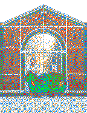

# Rubik's art

Table of Contents

- [Overview](#overview)
- [Stakeholders](#stakeholders)
- [Scope](#scope)
- [Personas and use cases](#personas-and-use-cases)
  - [1. Yves - Curious Citizen of Vierzon](#1-yves---curious-citizen-of-vierzon)
  - [2. Emily - Art Enthusiast](#2-emily---art-enthusiast)
  - [3. Alex - Engineering Enthusiast](#3-alex---engineering-enthusiast)
- [Evaluation criteria](#evaluation-criteria)
- [Proposed designs](#proposed-designs)
  - [Selected design solution](#selected-design-solution)
  - [Selected location](#selected-location)
  - [Earlier test phase](#earlier-test-phase)
- [Risks and assumptions](#risks-and-assumptions)
- [Non-functional requirements](#non-functional-requirements)
- [Maintaining](#maintaining)
- [Glossary](#glossary)

---

## Overview

ALGOSUP is looking for someone to produce a 60-100 square feet (5.57-9.29 square meter) fresco entirely made of Rubik’s cubes.  
The fresco will be a permanent feature of the school, displayed in what is currently the library and visible from the outside.

## Stakeholders 

|                                                        Profile                                                        | Name & link                                                | Description    |
| :-------------------------------------------------------------------------------------------------------------------: | ---------------------------------------------------------- | -------------- |
|                                  | [ALGOSUP](https://www.algosup.com/)                        | Client company |
|                 | [Lucas AUBARD](https://github.com/LucasAub)                | Team member    |
|  | [Vivien BISTREL](https://github.com/Bistrel2002)           | Team member    |
|                 | [Léo CHARTIER](https://github.com/leo-chartier)            | Team member    |
|              | [Quentin CLÉMENT](https://github.com/Quentin-Clement)      | Team member    |
|           | [Aurélien Fernandez](https://github.com/aurelienfernandez) | Team member    |
|             | [Thomas Planchard](https://github.com/thomas-planchard)    | Team member    |
|                                                | Students and other building employees                      | End user       |
|                                              | Passer-by                                                  | End user       |

## Scope

The main objective is to create a fresco that is both accepted by ALGOSUP and eye-pleasing.

Each cube making the fresco is to be treated as a 3x3 pixel[^1] matrix[^2], with each pixel being represented by a panel of either green, yellow, red, orange, blue or white color.  

The library may be rearranged or moved in order to make the fresco more visible.

The ability to take down the fresco to change the image is out of scope.

Resource-wise:
- The Rubik's cubes will be provided by the client.
- The team will be expanded to 49 people to help make the fresco. The organisation and role-splitting will be described in a later document.

Here is a table of milestones and deliverables dates:
| Date               | Milestone / Deliverable                                                               |
| ------------------ | ------------------------------------------------------------------------------------- |
| September 25, 2023 | Invitation to tender                                                                  |
| October 3, 2023    | Tender pitch and functional specifications (this document) submission                 |
| October 10, 2023   | Technical specifications (detailed plan) submission, team members aware of their role |
| October 20, 2023   | Fresco ready for final assembly                                                       |
| October 26, 2023   | Full assembly and verifications                                                       |
| October 27, 2023   | Sign-off presentation, team post-project meeting                                      |

## Personas and use cases

### 1. Yves - Curious Citizen of Vierzon

*Background:*
Yves is a 56-year-old long-time resident of Vierzon, known for frequently strolling down the "rue de la société française." He has two children: a 17-year-old daughter and a 15-year-old son.

*Goals and Objectives:*
Yves is curious about the world around him and often seeks out new experiences and information. He values education and wants the best for his children's future.

*Challenges:*
Yves is unfamiliar with the schools in the city and is looking for a reliable educational institution that can offer quality education for his children.

*Scenario:*
If Yves encounters the fresco every day on his way down the "rue de la société française," he will notice ALGOSUP's name. This may pique his curiosity, leading him to search for more information about the school. Yves is the kind of person who actively engages with his community, and when he discovers something interesting, he shares it with his children.

*Impact:*
If Yves learns about ALGOSUP and finds it appealing, he may discuss it with his children. This could potentially lead one of them to share the information with their friends or even consider joining ALGOSUP for their education. Yves' curiosity and engagement with his community could have a positive ripple effect, potentially increasing awareness and interest in the school.

### 2. Emily - Art Enthusiast

*Background:*
Emily is a 25-year-old student with a passion for unconventional mediums. She thrives on creative challenges and has experience in working with various materials.

*Goals and Objectives:*
Emily aims to create a visually striking and thought-provoking fresco that not only meets ALGOSUP’s requirements but also showcases her artistic talent.

*Challenges:*
Balancing artistic expression with technical constraints, and ensuring that the final piece effectively represents ALGOSUP's identity.

### 3. Alex - Engineering Enthusiast

*Background:*
Alex, 28, is a student from ALGOSUP with a keen interest in robotics and mechanical systems. He is excited about the opportunity to combine his technical skills with artistic expression.

*Goals and Objectives:*
Alex wants to leverage technology to optimize the cube rotations and assembly process, ensuring precision and efficiency in the creation of the fresco.

*Challenges:*
Designing a mechanical system that can seamlessly integrate with the artistic vision and coordinating with the artistic team to implement rotations effectively.

## Evaluation criteria 
The fresco will be a permanent feature in what is currently the school's library, serving as a visual representation of ALGOSUP's identity. It will encompass the following key elements:

- **ALGOSUP’s Logo:** The logo will be prominently featured as a central element of the design, representing the core identity of ALGOSUP.

- **Evocation of ALGOSUP’s Building:** The fresco will incorporate artistic elements that evoke the architectural characteristics of ALGOSUP's building, providing a unique connection between the artwork and the institution.

- **Color Palette:** The fresco will use a vibrant color palette derived from the Rubik's cube facets, including green, yellow, red, orange, blue, and white.

- **Text (Optional):** If included, any textual elements will be in English and will complement the overall design, conveying a message aligned with ALGOSUP’s values.

- **Dimensions and Layout:**
The fresco will be rectangular in shape, occupying an area between 60 and 100 square feet. The layout will be designed to maximize visibility from both the interior of the library and the exterior of the building.

- **Cubes Utilization:**
The design will incorporate a minimum of 2000 and a maximum of 3000 Rubik's cubes. Each cube will be treated as a 3x3 pixel matrix, with no disassembly allowed.

- **Cube Rotation and Positioning:**
All cubes will be rotated into position to create the desired artistic composition. Sequences of cube rotations will be recorded for documentation and social media content.

Additionally, recording of the construction must be provided in the form of a video or timelapse for the school's social media. 

## Proposed designs

### Selected design solution

This image was selected for the fresco by the entierety of our team.

We choose this solution for multiple reason:
- Simplicity: it catches the eye without being a burden
- History: this view of the building shows how important ALGOSUP's roots are within Vierzon
- Growth: the imposing size of the building shows the growth of the school and its students
- Accessibility: in the bottom left lies a QR code to ALGOSUP's website for easy access

This final version took some time to arrive at and other attempts were made, as shown below.

### Selected location

The fresco will be placed about 1m from the back wall of the library, to leave the sockets accessible. 

We had thought of 3 other places to place it: 

- above the sockets, but we were worried that the fresco would fall easily and that the weight of the fresco might damage the sockets, 
- against the windows, but we wanted to avoid obstructing the luminosity to keep natural light in the room.
- in the very middle of the room, but this would make the library unusable.

Every option had weaknesses but we've chosen the one that seems the least restrictive.

### Earlier test phase
 
 
 
 

During the research process we experimented a few design that are not very eye-pleasing.

Those tests made us realize that green and yellow colors do not render well with this type of cube, the colors are too vibrant to look nice with the rest.

We also thought of creating a two-faced fresco, for people outside of the school on one side, and for the people in the room on the other. However we quickly found that the time required and the difficulty of such task is greater than what we can realistically offer.

## Risks and assumptions

The main risk of the project is, not succeding in the creation of a presentable pixelated image containing the needed interval of Rubik's cubes. As such, a software program will be used in the making of the image and the generation of instructions for its construction.

## Non-functional requirements

During the exploration of the problem we also found multiple non-functional requirements here is the list:
- The accessibilty of the fresco, including cleaning and a clear view of it.
- A documentation of the procedure to reproduce/repair the fresco.
- The safety of the fresco, to avoid unnecessary destruction.
- The QR code readability, to access to ALGOSUP's website.

## Maintaining

The maintenance is an essential part of every project, particulary with artistic projects.

The fresco will need to be properly cleaned of dust and stains to keep the image properly visible.

The fresco might also be destroyed or small parts can be disasembled by accident, to overcome this, a member of the group will have to visit the fresco regularly to see if a part is missing or damaged.

## Glossary
[^1]: Pixel: The smallest unit of an image on a television or computer screen

[^2]: Matrix: A rectangular table of quantities or expressions in rows and columns that is treated as a single entity and manipulated according to particular rules.
