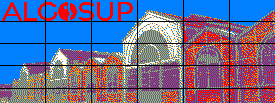

# Rubik's art

Table of Contents

- [Introduction](#introduction)
- [Audience](#audience)
  - [Stakeholders from ALGOSUP](#stakeholders-from-algosup)
  - [Members of Team 2 (Team Leader)](#members-of-team-2-team-leader)
  - [Members of Other Teams](#members-of-other-teams)
- [Deliverable](#deliverable)
- [Requirements](#requirements)
- [Nice to have](#nice-to-have)
- [Priorities](#priorities)
- [Non-Requirements / Out of scope](#non-requirements--out-of-scope)
- [Operating Requirements](#operating-requirements)
- [Assumptions](#assumptions)
- [Design Details](#design-details)
  - [Fresco Dimensions](#fresco-dimensions)
  - [Cube Representation](#cube-representation)
  - [Cube Arrangement](#cube-arrangement)
  - [Protective Measures](#protective-measures)
  - [Tasks division](#tasks-division)
  - [Distribution of tasks and instructions](#distribution-of-tasks-and-instructions)
  - [Fresco support](#fresco-support)
- [Maintenance and Upkeep](#maintenance-and-upkeep)
- [Software](#software)
  - [Technology Choice](#technology-choice)
- [Ideas and Hypotheses](#ideas-and-hypotheses)
  - [Unproven Hypotheses](#unproven-hypotheses)
  - [Proven Hypotheses](#proven-hypotheses)
- [Challenges](#challenges)
- [Possible Bugs](#possible-bugs)
  - [1. Misaligned Cubes:](#1-misaligned-cubes)
  - [2. Color Inconsistencies:](#2-color-inconsistencies)
  - [3. Structural Instability:](#3-structural-instability)
  - [4. Dust Accumulation:](#4-dust-accumulation)
  - [5. Cube Wear and Tear:](#5-cube-wear-and-tear)
- [Security Considerations](#security-considerations)
- [Success Evaluation](#success-evaluation)
- [Conclusion](#conclusion)
- [Glossary](#glossary)

---

## Introduction

The Rubik's Art Fresco is a permanent artwork commissioned by ALGOSUP, consisting of Rubik's cubes arranged to form a pixelated image[^3] representing the institution. This technical specification outlines the detailed implementation plan for the creation, installation, and maintenance of the fresco.

## Audience

### Stakeholders from ALGOSUP

- **ALGOSUP Executives and Decision-makers**: They are the primary stakeholders, responsible for approving the project and ensuring it aligns with ALGOSUP's vision and branding.
- **ALGOSUP Marketing Team**: They are interested in the visual appeal and representation of the school. The fresco will serve as a marketing tool, attracting potential students and parents.
- **ALGOSUP Students**: The fresco will be a part of their daily environment, potentially impacting their perception of the school and its values.

### Members of Team 2 (Team Leader)

- **Construction Team Leader**: Responsible for overseeing the construction process, ensuring each team completes their assigned sections accurately and efficiently.
- **Cube Handling Team Members**: Responsible for physically handling the Rubik's cubes, placing them in their designated positions according to the provided plans.
- **Documentation Team Members**: Responsible for recording cube rotations, capturing the construction process on film, and maintaining comprehensive documentation for future reference.

### Members of Other Teams

- **Project Managers**: They will be responsible for ensuring that their teams complete their assigned sections accurately and efficiently.
- **Cube Handling Team Members**: Responsible for physically handling the Rubik's cubes, placing them in their designated positions according to the provided plans.
- **Documentation Team Members**: Responsible for recording cube rotations, capturing the construction process on film, and maintaining comprehensive documentation for future reference.

## Deliverable

The deliverable for this project is a visually striking and meticulously constructed fresco created entirely from Rubik's cubes. The fresco will serve as a permanent feature within ALGOSUP, displayed in what is currently the library and visible from both the interior and exterior of the building. The project must be delivered by October 26.

## Requirements

- A minimum of 2000 and a maximum of 3000 Rubik's cubes to be used.
- Each Rubik's cube represents a 3x3 pixel matrix[^8] of colors: Green, Yellow, Red, Orange, Blue, and White.
- The construction process should be divided into multiple sections, assigned to different teams.
- The construction process should be recorded and documented for future reference.
- The final image should closely resemble the original prototype[^7].

## Nice to have

- Integration of Augmented Reality (AR)[^1] elements with the fresco could provide an innovative and engaging dimension. AR technology could enable viewers to interact with the artwork, potentially revealing additional information or dynamic visual effects. This would not only enhance the viewer experience but also showcase ALGOSUP as a forward-thinking institution embracing cutting-edge technology.
- Implementation of a specialized software program to demonstrate Rubik's cube movements. Introducing a specialized software program that visually demonstrates the possible movements of Rubik's cubes would greatly enhance team comprehension and precision during the construction process.

## Priorities

- Ensure structural stability and integrity of the fresco.
- Adhere to the specified cube count range (2000-3000 Rubik's cubes).
- Maintain visual appeal and accuracy of representation.
- Divide construction process into manageable sections.
- Be visible from outside the building.

## Non-Requirements / Out of scope

- Use of a robot for cube manipulation[^6] will not be pursued due to logistical constraints and time considerations. Indeed, the communication system with the robot is new to us and learning to use it would take too much time and the incorporation of its usage in parallel to the other teams is too much of a burden.
<!-- - Ability to disassemble the fresco for image modification is out of scope. -->

## Operating Requirements

Adequate lighting to be able to see the fresco from the outside.
Do not place objects in front of the fresco to block the view.

## Assumptions

- The provided Rubik's cubes will be of standard size and quality, without significant defects.
- The provided image overlay will accurately represent the desired final result.
- The needed material will be provided by the client on time.

##  Design Details

###  Fresco Dimensions

- Area of ≈9.3 square meters
- Rectangular shape to maximize visibility (184.8cm x 504cm)

###  Cube Representation

- Each Rubik's cube represents a 3x3 pixel matrix.
- Colors: Green, Yellow, Red, Orange, Blue, White.

###  Cube Arrangement

- The design will be composed of 2970 Rubik's cubes. (90x33)
- Cubes will be precisely rotated and positioned to create the desired artistic composition.
- The dimensions of a cube are 5.6x5.6x5.6 cm. 

<!-- ###  Mounting and Display

- The fresco will be placed on a plank securely attached to the wall over the sockets to prevent accidental displacement.
- A clear acrylic[^4] panel will be installed in front of the cubes to offer protection and reduce maintenance needs. -->

###  Protective Measures

- The mounting structure will be designed to minimize stress on the cubes.
- Periodic inspections will be conducted to ensure the structural integrity and stability of the fresco.
- a sheet affixed to the wall stating that it is forbidden to touch or remove cubes from the fresco

### Tasks division

ALGOSUP's students are divided in 8 project teams. When the final image will be chosen by the client, each team will have to collaborate to realize the final fresco. Even so, each one will have to work on their own under the control of the chosen team.

If chosen, Team 2 will primarily handle the organization and execution of the construction process.

Tasks will be divided into small, manageable blocks for easy distribution.

As you visible on the image below, we divided our fresco in 36 sections:
- 30 sections of 90 rubik’s cube (15 wide x 6 height)
- 6 sections of 45 rubik’s cube (15 wide x 3 height) at the bottom

Each team will be assigned specific sections to construct. This division of labor into 36 sections will enable us to tailor the workload to each team's pace.

Furthermore, each team will receive a detailed plan outlining their specific responsibilities, including the placement of Rubik's cubes within their assigned section. This plan will serve as a guide, ensuring accurate execution. Each team must deliver its sections to the library and return them in the same layout as on the plan, to make it easier for Team 2 to build the whole fresco when they need it.

### Distribution of tasks and instructions

The tasks will automatically be distributed by a software since the different work-hours of each team would make manual coordination hard.
The software will be written in Python, controlling a Google Spreadsheets.

The sheets will be divived as follows:
- Fresco: The image representation, divided in the different sections and cubes
- Moves: List of the initial position of the cubes and the rotations to be made, along with an indicator to keep track of the state (to be done, started, done, ...)

Additionally, to guarantee precise execution, we will employ a specialized software program that visually illustrates the various movements of the Rubik's cubes. The different workers will only have to read the instructions shown on their screen.

The added bonus of using such tools comes if the client wants to change the design. Indeed, simply changing the input image will automatically change the moves and instructions.

Note: If another team is selected, the softwares will happily be shared as they won't be of use otherwise and might even increase the overall construction speed.

### Fresco support

Simultaneously, our team will focus on designing, developing, and building the support structure for the fresco.

The fresco will be placed above the electrical outlets, on a board fixed to the wall with brackets. Another board will be placed above the fresco to protect it and hold it in place. It will also be fixed to the wall with brackets. 2 boards will be placed on either side of the fresco to fix it completely, screwed into the boards above and below.

## Maintenance and Upkeep

- Regular cleaning (each monday) to remove dust and maintain the visual appeal of the fresco.
- Routine inspections (each monday) to identify any missing or damaged cubes, with prompt replacement.
- Any necessary repairs or replacements will be performed promptly to ensure the longevity of the artwork.

## Software  

A software developed has been created to distribute the tasks between the teams and help with the actions to take. Such as cube rotation or cube placement.

### Technology Choice

Python will be used to program the software. The reason for this choice is based on the fact that we will be using a Google Spreadsheet to keep track of the work, its API[^2] being accessible in Python. Also, to incorporate external websites, Python is a good alternative to Google's AppScripts which does not implements all the classic methods of a website.

## Ideas and Hypotheses

### Unproven Hypotheses

- The division of labor into 36 sections will optimize the construction process for different teams.
- The use of a specialized software program will facilitate the construction process and improve the accuracy of the final result.

### Proven Hypotheses

In our case, Python is the best-suited programming language to develop the software. It's the one the team knows best, and the one best suited to our needs.

## Challenges

- Ensuring the structural integrity and stability of the fresco.
- Balancing artistic expression with technical constraints, and ensuring the final piece effectively represents ALGOSUP's identity.
- Adapt the fresco to the environment and make it well visible and understandable from the outside.

## Possible Bugs

### 1. Misaligned Cubes:

**Description:** There is a risk of cubes being slightly misaligned during the construction process, leading to a deviation from the intended image.

**Symptoms:** Visual discrepancies where adjacent cubes do not align perfectly, resulting in a jagged or uneven appearance in the image.

**Mitigation:** Conduct regular quality checks during the construction process, using precise measurements and alignment tools to ensure cubes are accurately positioned.

---

### 2. Color Inconsistencies:

**Description:** Due to variations in cube manufacturing, there is a possibility of slight color discrepancies between cubes of the same designated color.

**Symptoms:** Visual differences in shade or hue between adjacent cubes of the same color, affecting the overall uniformity of the image.

**Mitigation:** Thoroughly inspect and sort cubes by color before construction, aiming to match shades as closely as possible. Utilize cubes with the most consistent coloration for prominent areas.

---

### 3. Structural Instability:

**Description:** Inadequate support or fastening of the cubes may lead to sections of the fresco being unstable or prone to dislodging.

**Symptoms:** Observable movement or wobbling of cubes, especially in areas where they are not securely fastened to the support structure.

**Mitigation:** Ensure the support structure is robust and securely fastened before building the fresco in itself. Add new iron angles if the planks struggle to support the fresco. Conduct regular inspections to identify and address any structural issues. 

---

### 4. Dust Accumulation:

**Description:** Over time, dust and particles may accumulate on the surface of the fresco, potentially obscuring the image and diminishing its visual impact.

**Symptoms:** Gradual loss of clarity and vibrancy in the image due to a layer of dust settling on the cube surfaces.

**Mitigation:** Implement a regular cleaning schedule using non-abrasive materials[^9] to gently remove dust. Consider using a protective cover or plexiglass panel to minimize dust accumulation.

---

### 5. Cube Wear and Tear:

**Description:** Continuous handling of the Rubik's cubes during construction may lead to minor scratches or wear on the cube surfaces.

**Symptoms:** Surface imperfections or small scratches on the cubes, particularly in areas that have undergone frequent manipulation.

**Mitigation:** Prioritize the use of damaged cubes for areas where imperfections are less noticeable. Conduct thorough inspections of cubes before placement.

## Security Considerations

The mounting structure will be designed to minimize stress on the cubes and prevent accidental displacement.

## Success Evaluation

The success of the project will be determined by the feedback provided by the daily workers of the B3, as well as the degree of similarity between the final image and the original prototype. This evaluation will serve as a crucial indicator of the project's overall success and alignment with the intended vision.

The success of the project will be determined by the feedback provided by the daily workers of the B3 and bystanders, as well as the degree of similarity between the final image and the original prototype. This evaluation will serve as a crucial indicator of the project's overall success and alignment with the intended vision.

## Conclusion

By adhering to these technical specifications, we aim to create a Rubik's Art Fresco that not only meets ALGOSUP's vision but also stands as a durable and visually captivating representation of the institution's identity.

## Glossary

[^1]: **Augmented Reality (AR)**: A technology that overlays digital information (such as images, sounds, or 3D models) onto the real world through a device like a smartphone or AR headset.

[^2]: **API (Application Programming Interface)**: A set of rules and protocols that allows different software applications to communicate and interact with each other.

[^3]: **Pixelated Image**: An image that has been intentionally blurred or distorted to the point where individual pixels are visible, often used for artistic or privacy purposes.

[^4]: **Acrylic Panel**: A transparent sheet made of synthetic polymer material, commonly used to protect surfaces or provide a clear barrier. It is also known by many brand names such as Plexiglas or Hesalite.

[^6]: **Cube Manipulation**: The act of rotating and positioning Rubik's cubes to achieve a desired configuration or pattern.

[^7]: **Prototype**: A preliminary version or model of a product or project used for testing and evaluation.

[^8]: **Pixel Matrix**: A grid of individual pixels used to represent an image, where each pixel corresponds to a single point of color.

[^9]: **Non-abrasive Materials**: Substances that do not cause damage or wear when used on surfaces.