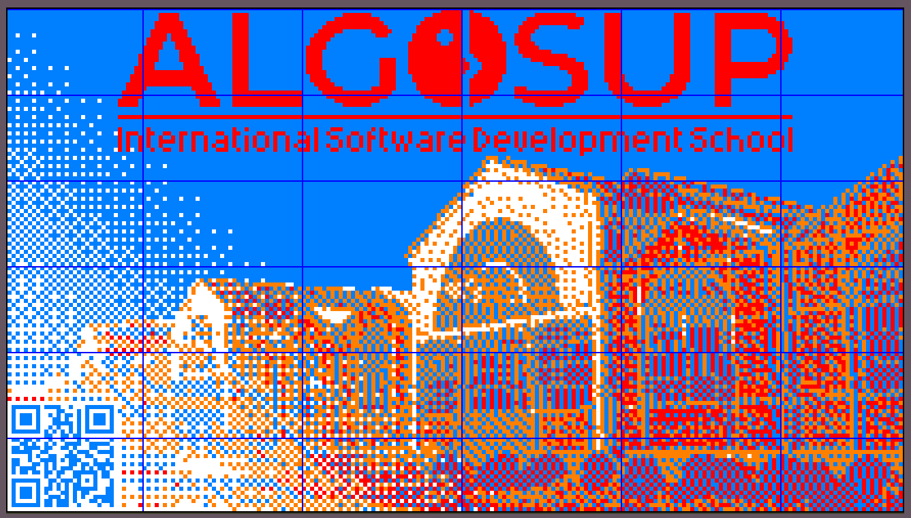

# Rubik's art

Table of Contents

- [Rubik's art](#rubiks-art)
  - [Overview](#overview)
  - [Construction of the fresco](#construction-of-the-fresco)
  - [Fresco support](#fresco-support)
  - [Technology used](#technology-used)

---

## Overview

ALGOSUP is looking for someone to produce a 60-100 square feet (5.57-9.29 square meter) fresco entirely made of Rubik’s cubes.  
The fresco will be a permanent feature of the school, displayed in what is currently the library and visible from the outside.

## Construction of the fresco

ALGOSUP's students are divided in 8 project teams. When the final image will be chosen by the client, each team will have to collaborate to realize the final fresco. Even so, each one will have to work on their on under the control of the chosen team.

As you can see above, we divided our image in 36 sections:
- 25 sections of 91 rubik's cube (13 width x 7 height)
- 5 sections of 78 rubik's cube (13 width x 6 width)
- 5 sections of 56 rubik's cube (8 width x 7 height)
- 1 section of 48 rubik's cube (8 width x 6 height)

Each team will receive sections to realize. Dividing the work into 36 sections will allow us to adapt the distribution of work to the speed of each team.

During this time, our team will work on the conception, the development and the construction of the fresco support.

## Fresco support

## Technology used 

We chose to use a machine to achieve the right combination with the rubik's cube to end up with the right faces for the fresco.
We made an algorithm in Python to find the combination with the least moves for each rubik's cube.

Our machine is made with Lego's programmable robot kit NXT 2.0. The program used to run our machine is made with a specific language made by Lego.

On average, to do a single rubik's cube it takes 30 seconds. By calculating the time it might takes around 25 hours, thus only considering only our machine is doing the cube and only one is used.

